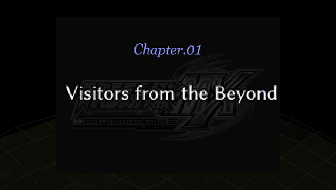

# Super Robot Taisen MX Portable — English translation project

An open toolchain for translating **Super Robot Taisen MX Portable** (PSP, Japanese edition **ULJS-00041**), plus the English patch built with it.

## Contribute

Bug reports, proofreading and playtesting are welcome. Include your build version, route, stage and an in-game screenshot in a [GitHub issue](https://github.com/retro-trans/SRW-MX-Portable/issues). You can also join [the Retro Trans Discord](https://discord.gg/MssepShjmB).

## Play it

The first published build is [v0.4.1](https://github.com/retro-trans/SRW-MX-Portable/releases/tag/v0.4.1). This is a **partial, experimental English translation**, covering the prologue and numbered stages **1–30**, including their translated route branches. It also includes battle captions, menus, names, library entries and other interface text. Later story stages, other chapter-card artwork and many closing messages remain Japanese.

You need your own matching Japanese ISO. Download `SRWMX-English-v0.4.1.xdelta` from the release page.

### Apply

**The easiest way:** [Retro Trans Tools](https://github.com/retro-trans/retro-trans-tools) provides a desktop interface for applying translation patches. Download the app from its Releases page and use **Automatic**: select the source ISO, wait for analysis, then click **Patch**. v0.4.1 is registered in the verified catalog. You can also use **Apply xdelta**: choose your original ISO, the downloaded patch and a new output filename.

**Other ways:** [DeltaPatcher](https://github.com/marco-calautti/DeltaPatcher) accepts the same `.xdelta` file. Select your Japanese ISO as the original file and the patch as the delta.

**Command line:** Get [xdelta3](https://github.com/jmacd/xdelta), then run:

```sh
xdelta3 -d -s "Super Robot Taisen MX Portable (Japan).iso" SRWMX-English-v0.4.1.xdelta "SRWMX English v0.4.1.iso"
```

The source and output hashes are recorded in the release's `BUILD-MANIFEST.json` and `README-v0.4.1.txt`. Keep source checksum verification enabled. This release provides a full patch from the original Japanese ISO; it does not accept earlier local English test builds as its source.

Use an in-game save when switching builds and restart the game. Emulator save states retain the old executable and resources. The font and translated artwork are native game patches; no emulator texture replacement is required.



## Status

- Prologue and stages 1–30 story translations are inserted; all route branches represented by the reviewed stage files are included.
- Battle caption insertion was checked across 51,892 entries with no mismatches.
- Latin dialogue uses a proportional Genei LateGo font with a native 4× atlas. Descenders, including the bottom of `g`, are preserved.
- v0.4.1 adds Kaine's requested closing line in three occurrences and the stage 1 Super card **Visitors from the Beyond**.
- PPSSPP checks cover selected dialogue, interface screens and the translated chapter card. A complete campaign playthrough and physical PSP testing remain pending.
- Stage 8's expanded script exceeds the original game's largest block. Its allocation uses the actual block size, but peak gameplay memory remains unverified. Please report any **Malloc Memory Over** error.

See [the changelog](docs/CHANGELOG.md) for each build's changes and testing limits.

## Check or change the translation

The repository stores English translations and source locations. Original Japanese dialogue is extracted from your own ISO into ignored local files; it is never committed.

Start with [TRANSLATING.md](TRANSLATING.md). Translation rules are in [BASE_RULES.md](BASE_RULES.md); the term list is [work/glossary/glossary.json](work/glossary/glossary.json). [Akurasu's MX wiki](https://akurasu.net/wiki/Super_Robot_Wars/MX) is the main terminology reference, with exceptions documented in [glossary decisions](docs/glossary_decisions.md).

## What is here

| Path | Contents |
|---|---|
| `tools/` | Extraction, insertion, font, fitting and verification tools |
| `work/translation/en/script/*.en.json` | Reviewed English dialogue with original scene/string locations |
| `work/translation/en/battle/*.en.json` | English battle captions |
| `work/translation/en/ui/`, `static2/` | Interface and database translations |
| `work/glossary/` | Terminology, references and decisions |
| `work/ui/` | In-game screenshots and layout metadata |
| `docs/` | Technical findings, translation workflow, handoff and changelog |
| `incoming/fonts/` | Licensed source font and its notices |
| `work/output/` | Local test images and release assets; ignored by Git |

## How it was translated

This is **machine translation produced with language models and then edited**. The stages 1–30 campaign pass used Sol 6.1 at Medium effort, followed by context, terminology and text-fit review. Model experiments are separate from the selected campaign translation. Full human proofreading has not been completed; automated checks do not establish translation accuracy or complete gameplay compatibility.

## Credits

Project coordination: **Binh**. Translation, tooling and reverse engineering were assisted by OpenAI Codex models under the project lead's direction. Terminology follows the SRW community's [Akurasu reference](https://akurasu.net/wiki/Super_Robot_Wars/MX).

The font is [Genei LateGo by o_tamon](https://okoneya.jp/font/genei-latin.html), from the Genei Latin v2.1 package. Its copyright acknowledgements and SIL Open Font License accompany the repository and patch release. See [THIRD_PARTY_NOTICES.md](THIRD_PARTY_NOTICES.md).

README and release organization follow the [SRW-Z project](https://github.com/retro-trans/SRW-Z). Release manifests and patch verification use [Retro Trans Tools](https://github.com/retro-trans/retro-trans-tools).

## Do not sell this

The fan patch is free. Do not sell it, pre-patched game images, or access to the downloads. No complete game images are distributed here. The original game and its assets remain the property of their respective rights holders; use a copy you own.
